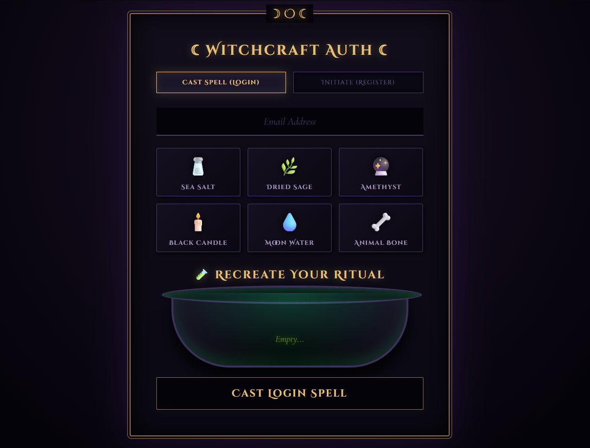

Vid walkthrough https://drive.google.com/file/d/1TF7MbSroC97i-V02QPq3arwO3JerdOC7/view?usp=sharing

🔮 Witchcraft Auth: The Ancient Grimoire

A creative, dark-fantasy take on standard MERN stack authentication. Instead of typing a traditional password users authenticate by casting a specific "ritual sequence" of magical ingredients into an animated cauldron. 

This project was built to demonstrate full-stack integration, secure data hashing, and advanced React/CSS UI interactions.

✨ Features

Ritual-Based Authentication: Replaces standard text passwords with an array of visual ingredients (min 4, max 6).
Advanced UI Animations: Uses React `useRef` to track mouse clicks and CSS `@keyframes` to animate ingredients flying across the screen and splashing into the cauldron.
Secure Hashing: The visual array is normalized into a string and securely hashed using `bcrypt` before being stored in MongoDB. Raw passwords are never saved.
Dynamic Validation: Real-time error handling with visual feedback (Green for successful spells, Red for failed rituals).
Modern Architecture: Built with Vite for a lightning-fast React frontend and Express/Node.js for a lightweight backend.

🛠️ Tech Stack

Frontend: React (Vite), Pure CSS3 (Custom animations & 3D styling), Axios
Backend: Node.js, Express.js
Database: MongoDB Atlas, Mongoose
Security: Bcrypt (Salting & Hashing), CORS

🚀 Getting Started

To run this project locally, you will need two terminal windows running simultaneously.

 Prerequisites
Make sure you have [Node.js](https://nodejs.org/) installed and a [MongoDB Atlas](https://www.mongodb.com/cloud/atlas) cluster set up.
